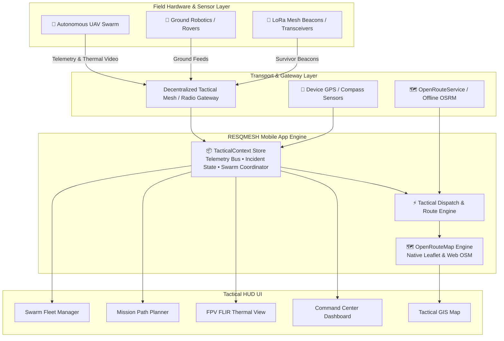

<div align="center">

# 🛰️ RESQMESH Mobile Command Center
### Tactical Disaster Response, Swarm Orchestration & Offline Search-and-Rescue (SAR)

[](https://expo.dev/)
[](https://reactnative.dev/)
[](https://react.dev/)
[](https://www.typescriptlang.org/)
[](https://expo.dev/)
[](./LICENSE)

<p align="center">
  <b>A mission-critical tactical command platform engineered for emergency responders, air-ground drone swarms, and decentralized mesh networks operating in zero-cellular, disaster-compromised environments.</b>
</p>

[Key Features](#-key-features) • [System Architecture](#-system-architecture) • [App Modules](#-app-modules--screen-tour) • [Tech Stack](#-tech-stack) • [Getting Started](#-getting-started) • [Offline Protocol](#-offline--zero-network-resilience)

---

</div>

## 📌 Overview

During catastrophic events—such as flash floods, earthquakes, landslides, and major structural collapses—traditional telecommunications and cellular towers are frequently destroyed or congested. In these high-stakes, time-critical windows, search-and-rescue teams require continuous situational awareness, immediate aerial surveillance, and coordinated unit dispatch.

**RESQMESH Mobile Command Center** provides tactical field teams with a decentralized, mobile-first unified operations dashboard. Built with **React Native** and **Expo SDK 57**, it integrates real-time autonomous drone telemetry, FLIR thermal human detection, dynamic geospatial route planning, and instant asset tasking into a cybernetic HUD designed for high-stress field conditions.

---

## ⚡ Key Features

- **🌐 Zero-Cellular Tactical Awareness**: Designed for off-grid operation via local mesh radio networks (LoRa / 802.11ah / BLE gateways) with deterministic local state and routing fallbacks.
- **🗺️ Interactive Tactical Map (Cross-Platform)**:
  - Dynamic marker layers for air/ground assets, incident hazard zones, survivor beacons, triage stations, and trauma hospitals.
  - Multi-engine rendering: Native Leaflet / MapView on mobile devices with OpenStreetMap fallback on Web.
  - Live vector lines, pulsating detection rings, and terrain hazard overlays.
- **🛰️ Autonomous Drone Swarm Orchestration**:
  - Live FPV camera view with instant toggling between optical RGB and FLIR thermal infrared feeds.
  - Visual target acquisition reticles with real-time AI bounding box confidence overlays (e.g., human detection at 94% confidence).
  - Real-time telemetry HUD displaying altitude, pitch, roll, ground speed, battery voltage, and satellite link metrics.
- **🚨 Instant Incident Reporting & Auto-Dispatch**:
  - Multi-hazard incident intake (Flash Floods, Structural Collapse, Wildfire, Trauma, Landslides, Missing Persons).
  - High-precision GPS auto-lock via hardware sensors with manual coordinate override.
  - On-scene evidence collection via camera/media picker.
  - Algorithmic dispatch matching the closest capable asset to reported emergencies.
- **📋 Multi-Step Autonomous Mission Planner**:
  - Intuitive 4-phase mission configuration (Coverage Area, Waypoint Routing, AI Sensor Payload, Over-The-Air Mission Upload).
  - Geofence controls, sweep velocity budgeting, and sensor trigger parameters.
- **🤖 Fleet Inventory & Battery Telemetry**:
  - Granular asset monitoring for UAV drones, UGV ground rovers, K9 search units, and watercraft.
  - Live battery gauges, maintenance status indicators, and one-tap incident assignment toggles.
- **📦 Blackbox Mission History & Audit Trail**:
  - Immutable chronological mission logs, incident status changes, and operator action journals with search and category filtering.

---

## 🏗️ System Architecture



---

## 📱 App Modules & Screen Tour

| Screen | File | Description |
|---|---|---|
| **HUD Splash** | `src/screens/SplashScreen.tsx` | Cybernetic radar sweep, system initialization, cryptographic node handoff. |
| **Tactical Onboarding** | `src/screens/OnboardingScreen.tsx` | 3-phase briefing covering AI sensor detection, mesh topology, and swarm controls. |
| **Command Center** | `src/screens/CommandCenterScreen.tsx` | Active incident stream, network health indicators, rapid response triggers. |
| **Live Tactical Map** | `src/screens/LiveMapScreen.tsx` | High-contrast map canvas, asset vectors, survivor beacons, telemetry slide drawer. |
| **Live Monitoring** | `src/screens/LiveMonitoringScreen.tsx` | Real-time drone video stream with RGB/Thermal FLIR toggle, crosshairs, and live detection banner. |
| **Detection Details** | `src/screens/DetectionDetailsScreen.tsx` | Forensic thermal frame inspection, 94% confidence verification, one-touch GPS coordinate export. |
| **Create Incident** | `src/screens/CreateIncidentScreen.tsx` | Rapid emergency logging, auto-GPS capture, photo evidence upload, and automated unit dispatch. |
| **Mission Planner** | `src/screens/MissionPlanningScreen.tsx` | Autonomous search grid configuration, waypoint sequencing, and OTA drone upload. |
| **Asset Fleet** | `src/screens/AssetSelectionScreen.tsx` | Real-time asset inventory, battery charge levels, active missions, and deployment toggles. |
| **Mission Logs** | `src/screens/MissionHistoryScreen.tsx` | Blackbox operational logbook, searchable incident history, telemetry audit trail. |
| **Operator Profile** | `src/screens/ProfileScreen.tsx` | Field operator callsign, node status, and tactical preferences. |

---

## 💻 Tech Stack

### Core & Framework
- **[React Native 0.86.3](https://reactnative.dev/)**: High-performance mobile framework.
- **[Expo SDK 57](https://expo.dev/)**: Native APIs, cross-platform build toolchain, and unified developer experience.
- **[React 19.2.3](https://react.dev/)**: Modern component model with concurrent rendering.
- **[TypeScript 6.0](https://www.typescriptlang.org/)**: Full strict type safety across all components and state models.

### Navigation & Layout
- **[@react-navigation/native](https://reactnavigation.org/)**: Fluid screen stacks and tabs.
- **[@react-navigation/bottom-tabs](https://reactnavigation.org/docs/bottom-tab-navigator)**: Cybernetic bottom command HUD.
- **[react-native-safe-area-context](https://github.com/th3rdwave/react-native-safe-area-context)**: Edge-to-edge layout adaptation for notches and dynamic islands.

### Mapping & Geolocation
- **[react-native-maps](https://github.com/react-native-maps/react-native-maps)** & **Leaflet**: Native GIS and web map rendering.
- **[react-native-webview](https://github.com/react-native-webview/react-native-webview)**: Embedded high-performance canvas engine for map tiles.
- **[expo-location](https://docs.expo.dev/versions/latest/sdk/location/)**: High-accuracy native GPS sensor bindings.
- **OpenRouteService (ORS)**: Real-time road and off-road emergency routing API.

### Hardware & Peripherals
- **[expo-image-picker](https://docs.expo.dev/versions/latest/sdk/imagepicker/)**: In-field emergency evidence photo capture.
- **[expo-clipboard](https://docs.expo.dev/versions/latest/sdk/clipboard/)**: One-tap military coordinate sharing.

---

## 🚀 Getting Started

### Prerequisites
- **Node.js**: `v20.x` or higher recommended.
- **npm** or **yarn** package manager.
- **Expo Go** app on your physical iOS/Android device, or an active Android Emulator / iOS Simulator.

### 1. Clone the Repository
```bash
git clone https://github.com/your-username/resqmesh_mobile.git
cd resqmesh_mobile
```

### 2. Install Dependencies
```bash
npm install
```

### 3. Configure Environment Variables
Copy the example environment file and add your configuration:
```bash
cp .env.example .env
```
*(Optional)* Add an [OpenRouteService API key](https://openrouteservice.org/) to enable live routing calculations:
```env
EXPO_PUBLIC_ORS_API_KEY=your_openrouteservice_api_key_here
```
> **Note**: If no API key is provided, the application automatically falls back to deterministic simulated tactical routes, ensuring 100% functionality in offline mode.

### 4. Run the Application

```bash
# Start the Expo development server
npm start

# Run directly on Android (requires connected device or emulator)
npm run android

# Run directly on iOS (requires macOS and Xcode)
npm run ios

# Run in Web browser
npm run web
```

Scan the QR code printed in the terminal using the **Expo Go** application (Android) or the **Camera** app (iOS).

---

## 📡 Offline & Zero-Network Resilience

RESQMESH is engineered from the ground up to survive real-world field conditions where infrastructure is down:

1. **Deterministic Local State**: Operational data (active missions, fleet positions, incident reports, and tactical logs) resides in reactive local memory with graceful offline persistence.
2. **Dynamic Route Fallbacks**: If external routing services (ORS/OSRM) are unreachable due to lack of cellular data, the tactical engine computes direct vector geodesics and offline simulated flight paths.
3. **Local Cacheable Map Assets**: Vector maps and UI overlays render independently of external CDNs, maintaining coordinate grid integrity during complete blackouts.

---

## 📂 Project Structure

```
resqmesh_mobile/
├── assets/                    # Application icons, splash screens, and imagery
├── src/
│   ├── components/            # Reusable UI components (HUD badges, maps, cards)
│   │   ├── OpenRouteMap.native.tsx # Native Leaflet/WebView map engine
│   │   └── OpenRouteMap.web.tsx    # Responsive Web OSM engine
│   ├── context/               # Global state providers
│   │   └── TacticalContext.tsx     # Swarm telemetry, incidents, and mission store
│   ├── dispatch/              # Tactical dispatch algorithms
│   │   └── tacticalDispatchEngine.ts
│   ├── hooks/                 # Custom React hooks
│   ├── map/                   # GIS coordinate utilities and map presets
│   │   └── tacticalMapData.ts
│   ├── navigation/            # Navigation routing & tab navigators
│   │   └── AppNavigator.tsx
│   ├── screens/               # 11 Operational tactical screens
│   │   ├── CommandCenterScreen.tsx
│   │   ├── LiveMapScreen.tsx
│   │   ├── LiveMonitoringScreen.tsx
│   │   ├── DetectionDetailsScreen.tsx
│   │   ├── CreateIncidentScreen.tsx
│   │   ├── MissionPlanningScreen.tsx
│   │   ├── AssetSelectionScreen.tsx
│   │   ├── MissionHistoryScreen.tsx
│   │   ├── OnboardingScreen.tsx
│   │   ├── ProfileScreen.tsx
│   │   └── SplashScreen.tsx
│   ├── services/              # External APIs & mesh communication bridges
│   │   └── openRouteService.ts
│   ├── theme/                 # Tactical design tokens (Colors, Typography)
│   ├── types/                 # TypeScript interfaces and telemetry schemas
│   └── utils/                 # Coordinate formatters & helper routines
├── app.json                   # Expo configuration & native permissions
├── package.json               # Dependencies and scripts
└── tsconfig.json              # TypeScript configuration
```

---

## 🛡️ License

This project is licensed under the **MIT License** - see the [LICENSE](./LICENSE) file for details.

---

<div align="center">
  <sub>Engineered for Emergency Responders & Disaster Recovery Teams.</sub>
</div>
